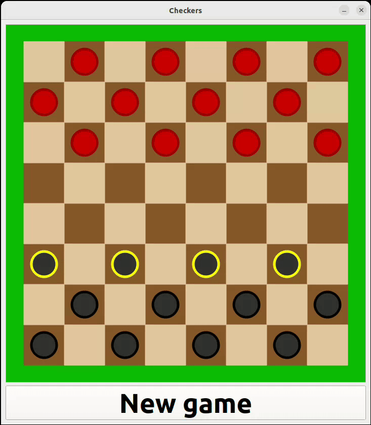

# Checkers
C++ implementation of classic Checkers game using Qt 6.2.4 library. It features standard rules:
* capture is mandatory
* any backward direction, including capture, is possible only for promoted pieces
* promoted piece can move in any direction, 1 field per turn

**Windows and Linux executables are provided.**

# Tests
Unit tested using Google Test 1.11.0

# How to run on Linux
1. Download release zip from:\
   https://github.com/adam-choragwicki/Checkers_Game_Qt_Cplusplus/releases/latest/download/executable_linux.zip
2. Unzip
3. Run **executable_linux/Checkers.sh**

**OR**

1. Clone repository and run **Checkers.sh**

# How to run on Windows
1. Download release zip from:\
   https://github.com/adam-choragwicki/Checkers_Game_Qt_Cplusplus/releases/latest/download/executable_windows.zip
2. Unzip
3. Run **executable_linux/Checkers.exe**

**OR**

1. Clone repository and run **Checkers.bat**
